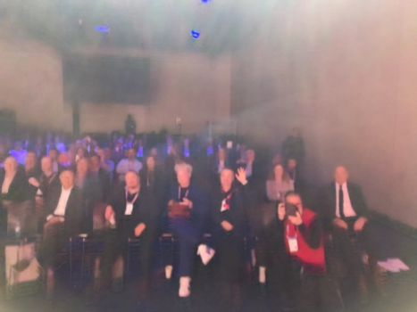

# Engagement Analysis Report - OpenGatewaySummit-2026

**Generated:** 2026-03-04 10:28:22

## Analysis Results

### First Image Analysis
 The image shows a room with several people seated facing towards the front where there's a speaker or presentation screen. The engagement level appears to be high as most individuals are attentively looking in that direction, suggesting they are focused on the ongoing event or discussion. The atmosphere is professional and formal, likely an academic or business setting. 

### Second Image Analysis  
 The image shows a group of people sitting in rows facing a stage, suggesting they are engaged in a presentation or an event. Their attention seems to be directed towards something happening on the stage, indicating a high level of engagement with whatever is being presented or discussed. 

### Comparison Analysis
 Both images depict audiences in settings where they appear to be attentive and focused on the front of the room or a stage, which indicates that there is likely some form of presentation or event taking place that has captured their attention. The level of engagement seems similar across both images, with most individuals appearing engaged in what is happening at the front. 

### Summary
 Engagement level appears similar in both images; no clear winner. 

## Files
- Image 1: 
- Image 2: 
