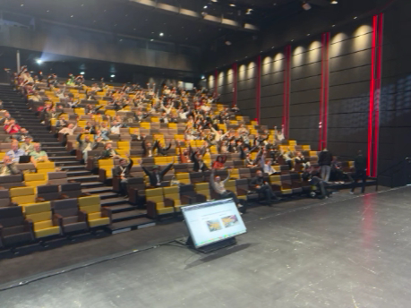

# Engagement Analysis Report - apidays-paris-2025

**Generated:** 2025-12-10 15:52:48

## Analysis Results

### First Image Analysis
 The image shows an auditorium filled with people seated in rows of seats, suggesting a high level of engagement as they are all facing towards a stage or speaker's area. Some attendees appear to be paying attention, while others might be in conversation or using their devices. 

### Second Image Analysis  
 The image shows a lecture hall filled with people seated on chairs, looking towards the front where a speaker or presentation is taking place. The setting appears to be a formal event or educational seminar. While there's no direct view of the audience's faces and reactions, their posture suggests engagement and attentiveness, which is typical for such events. 

### Comparison Analysis
 Both images depict an audience engaged in an event, possibly a lecture or presentation. The first image shows a larger crowd with a higher density of people, suggesting it might be a more popular or high-demand event. The second image has fewer attendees and seems to be in a less formal setting, which could mean the event is smaller scale or possibly less formal in nature. Both images convey an atmosphere of attentiveness and interest from the audience. 

### Summary
 First image: higher engagement level due to larger crowd and higher density of people. 

## Files
- Image 1: 
- Image 2: 
